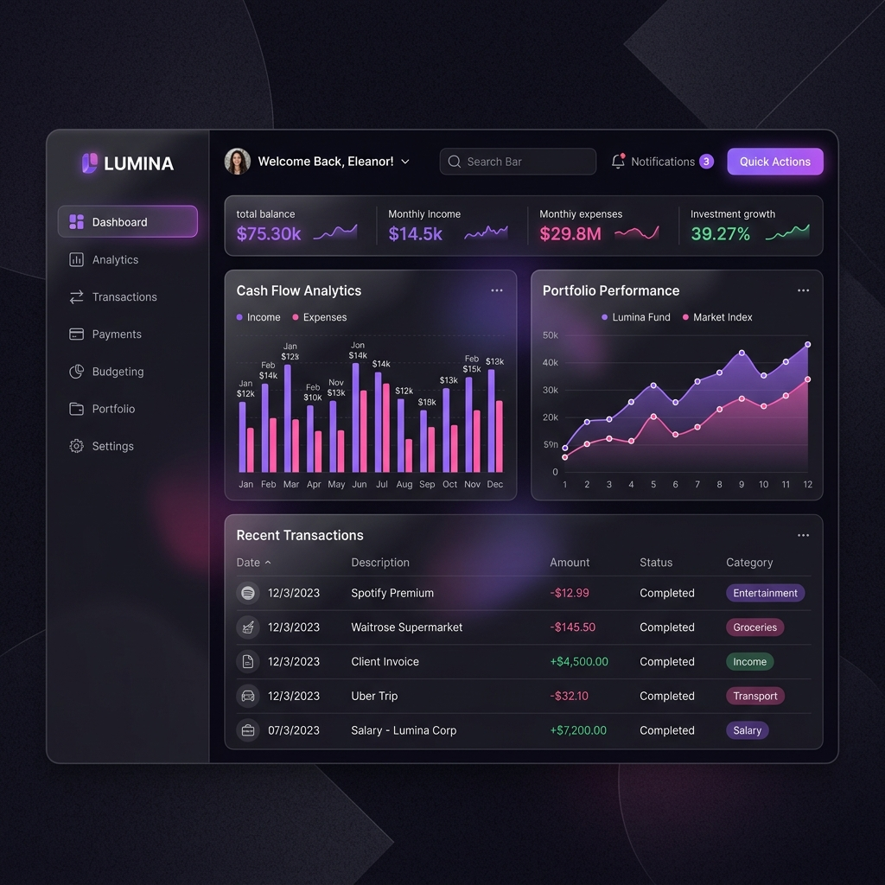
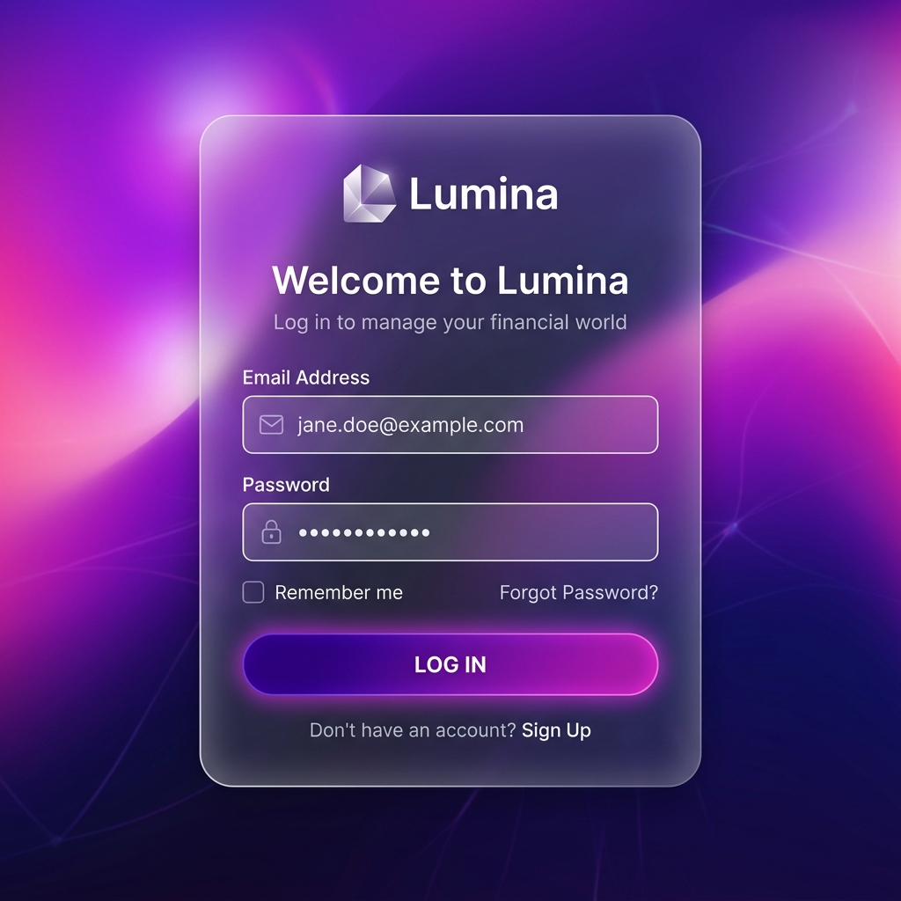
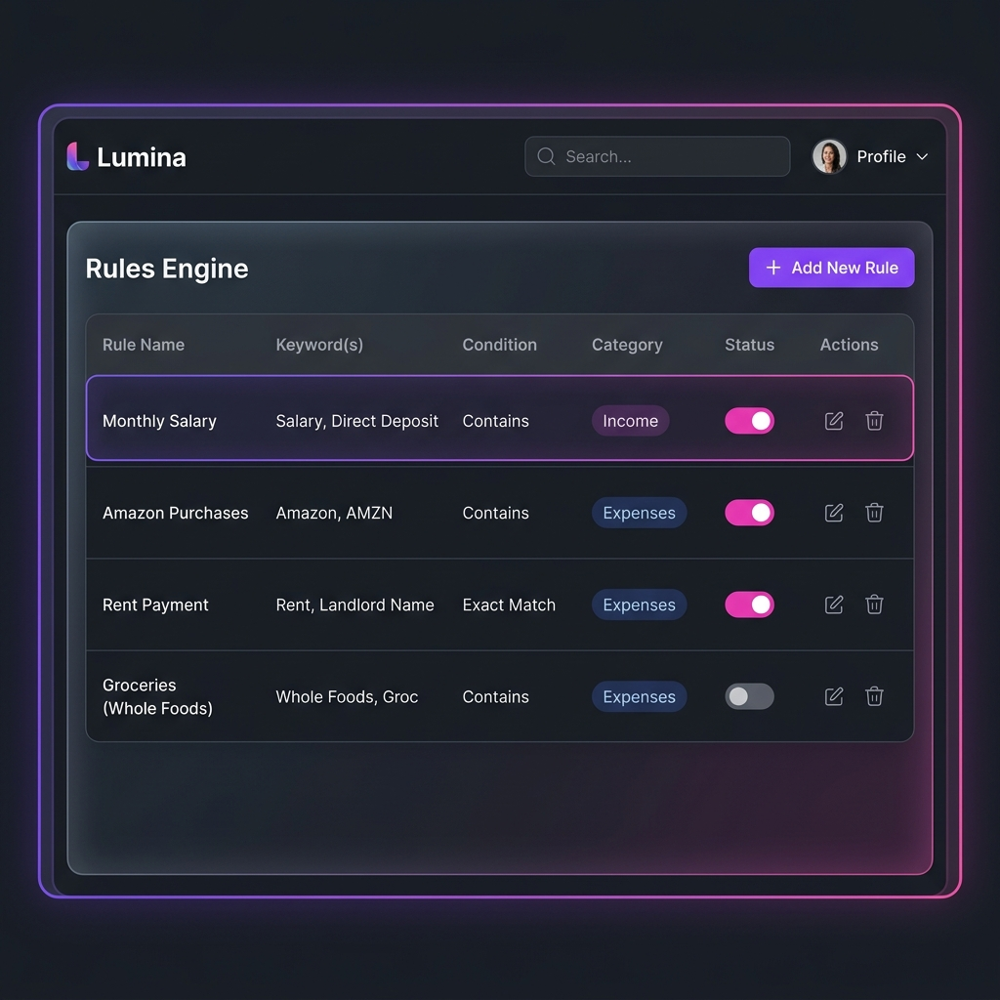

# Lumina - Product Showcase ✨

*(English version below)*

> **Nota:** Este es un repositorio de exhibición creado para reclutadores y evaluaciones técnicas. El código completo contiene lógica de negocio propietaria y configuraciones sensibles, por lo que aquí solo se presentan muestras arquitectónicas cuidadosamente seleccionadas y capturas de la interfaz.

Bienvenido a **Lumina**, una plataforma moderna de gestión y clasificación financiera. Lumina utiliza un motor de reglas para categorizar automáticamente los movimientos bancarios, brindando a las empresas una visión clara de su flujo de caja.

## 📸 Capturas de la Aplicación

- **Vista General del Dashboard:**
  

- **Pantalla de Inicio de Sesión:**
  

- **Gestión de Reglas:**
  

---

## 🛠 Stack Tecnológico

Lumina está construida con una arquitectura robusta, moderna y escalable:

**Frontend:**
- **Next.js (React)** para páginas rápidas con renderizado del lado del servidor y generación estática.
- **NextUI & Tailwind CSS** para una interfaz altamente responsiva, inspirada en "glassmorphism" y accesible.
- **Lucide React** para una iconografía consistente.

**Backend:**
- **Python 3 & FastAPI** para APIs REST asíncronas de alto rendimiento.
- **SQLAlchemy (Async)** para interacciones robustas con la base de datos mediante ORM.
- **PostgreSQL** como base de datos relacional principal.
- **Motor de Reglas Personalizado** para la categorización inteligente de datos financieros.

---

## 🏗 Puntos Clave de la Arquitectura

### 1. Motor de Reglas Extensible
El backend implementa un motor de reglas altamente desacoplado que clasifica las transacciones financieras entrantes. Prioriza las reglas definidas por el usuario en la base de datos, recurriendo a reglas semilla genéricas (hardcoded) cuando no hay coincidencias exactas. Esto asegura una alta tasa de aciertos manteniendo la flexibilidad del sistema.

### 2. UI Basada en Componentes
El frontend utiliza una arquitectura orientada a componentes con NextUI. Pantallas como el `LoginPage` gestionan su estado de forma local y se comunican de forma segura con el backend. Emplea patrones modernos de React y efectos visuales muy atractivos (gradientes, desenfoques).

### 3. Modelos de Datos Seguros y Escalables
La base de datos utiliza modelos bien definidos en SQLAlchemy, garantizando la integridad de los datos. Aplicamos prácticas estándar de la industria como hash de contraseñas, control de acceso basado en roles y un riguroso registro de fechas (timestamps).

---

## 📁 Muestras de Código

En el directorio `code-samples/`, puedes encontrar algunos fragmentos seleccionados que demuestran el estilo de programación, estructura y arquitectura del proyecto:

- **`code-samples/frontend/LoginPage.tsx`**: Demuestra la integración de componentes de NextUI, manejo de estado y llamadas a API en React.
- **`code-samples/backend/rules_engine.py`**: Muestra la lógica principal utilizada para clasificar movimientos de banco basándose en palabras clave y prioridad de reglas.
- **`code-samples/backend/user_model.py`**: Un modelo estándar de SQLAlchemy que ilustra cómo estructuramos las entidades de base de datos de manera segura.

## 📬 Contacto
Si deseas ver una demostración en vivo o hablar en detalle sobre la arquitectura de este proyecto, ¡por favor contáctame directamente!

---
---

# Lumina - Product Showcase (English) ✨

> **Note:** This is a showcase repository tailored for recruiters and technical evaluations. The full codebase contains proprietary business logic and sensitive configurations, which is why only carefully selected architectural samples and UI screenshots are presented here.

Welcome to **Lumina**, a modern financial classification and management platform. Lumina leverages powerful rules engines to automatically categorize bank movements, providing businesses with clear insights into their cash flow.

## 📸 Application Screenshots

- **Dashboard Overview:**
  

- **Login Screen:**
  

- **Rules Management:**
  

---

## 🛠 Tech Stack

Lumina is built with a robust, modern, and scalable architecture:

**Frontend:**
- **Next.js (React)** for fast, server-rendered and statically generated pages.
- **NextUI & Tailwind CSS** for a highly responsive, glassmorphism-inspired, and accessible user interface.
- **Lucide React** for consistent iconography.

**Backend:**
- **Python 3 & FastAPI** for high-performance, asynchronous REST APIs.
- **SQLAlchemy (Async)** for robust ORM database interactions.
- **PostgreSQL** as the primary relational database.
- **Custom Rules Engine** for intelligent categorization of financial data.

---

## 🏗 Architecture Highlights

### 1. Extensible Rules Engine
The backend implements a highly decoupled rules engine that classifies incoming financial transactions. It prioritizes user-defined rules stored in the database, falling back to a hardcoded generic seed of rules if no custom matches are found. This ensures a high match rate while keeping the system flexible.

### 2. Component-Driven UI
The frontend utilizes a component-driven architecture using NextUI. Screens like the `LoginPage` manage their state locally and communicate with the backend securely. It uses modern React patterns (Hooks, Context, Server Components where applicable) and visually stunning gradients and blurs.

### 3. Secure and Scalable Data Models
The database uses well-defined SQLAlchemy models, ensuring data integrity. We use standard practices like hashed passwords, role-based access control, and comprehensive timestamping.

---

## 📁 Code Samples

In the `code-samples/` directory, you can find a few selected snippets that demonstrate the coding style, structure, and architecture of the project:

- **`code-samples/frontend/LoginPage.tsx`**: Demonstrates the integration of NextUI components, state management, and API calls in a React Server/Client Component context.
- **`code-samples/backend/rules_engine.py`**: Showcases the core logic used to classify bank movements based on keywords, prioritizing user rules over generic rules.
- **`code-samples/backend/user_model.py`**: A standard SQLAlchemy model demonstrating how we structure our database entities.

## 📬 Contact
If you'd like to see a live demo or discuss the full architecture in detail, please reach out directly!
